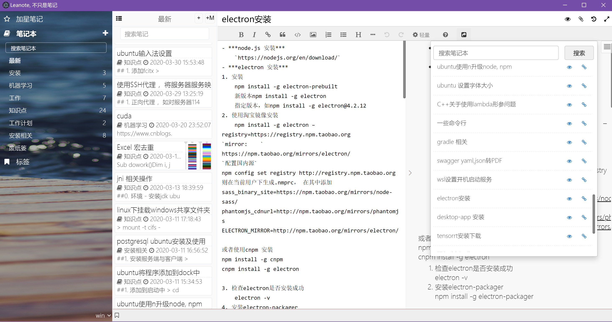

# Leanote Desktop App

## Description
Fork from https://github.com/leanote/desktop-app, I only modify leanote with local mode, not test with server.

## Change List

- Turn on local mode, and fix the bug of blank screen when creating accout with it.
- Add view mode for attach file and link with 'leanote:' pre. Support pdf, many source type, c,c++,java,etc.
- Fix the bug of mind map, after insert mind map, you can edit when click it.
- Add Link note for markdown and mce editor, can insert a local leanote link very simple. Support search note with key word, but only support search title and content, tag not supported for now.
- Add export all notes with pdf and leanote format
- Add import leanote notes with root notebook, and support import with dir.
- Add support for hign version of nodejs，electron (bigger than 4.0.0, such as 8.0.0) and gulp, fix the blank screen when editing the mind map.
- Not show sync flag with local mode.
- Fix the image bug of base64 encoded, can not be save as ..
- Fix import and export note bug, the img tag with local image not correct processed.
- Fix the view image not found bug when importing same note id.
- Fix some theme bug, such as not show correct with some mode or platform.

Use Electron(atom-shell) to create leanote desktop app.



## Download
Orgin project, please see http://app.leanote.com


## How to develop it

### 1. Install Electron

See https://github.com/atom/electron#downloads


### 2. Run it with electron

Download this project, and run

```shell
# 1. use gulp to parse less
$> cd PATH-TO-LEANOTE-DESKTOP-APP/dev
$> npm install
$> gulp dev

# 2. run with electron
$> cd PATH-TO-LEANOTE-DESKTOP-APP
$> electron .
```

### 3. Packet it with electron-packager

```
$> electron-packager ./ leanote --out=../leanote --electron-version=8.0.0
```

## Docs

Please see https://github.com/leanote/desktop-app/wiki


## LICENSE

[LICENSE](https://github.com/leanote/desktop-app/blob/master/LICENSE)

```
LEANOTE - NOT JUST A NOTEPAD!

Copyright by the contributors.

This program is free software; you can redistribute it and/or modify
it under the terms of the GNU General Public License as published by
the Free Software Foundation; either version 2 of the License, or
(at your option) any later version.

This program is distributed in the hope that it will be useful,
but WITHOUT ANY WARRANTY; without even the implied warranty of
MERCHANTABILITY or FITNESS FOR A PARTICULAR PURPOSE.  See the
GNU General Public License for more details.

Leanote destop app is licensed under the GPL v2.
```
